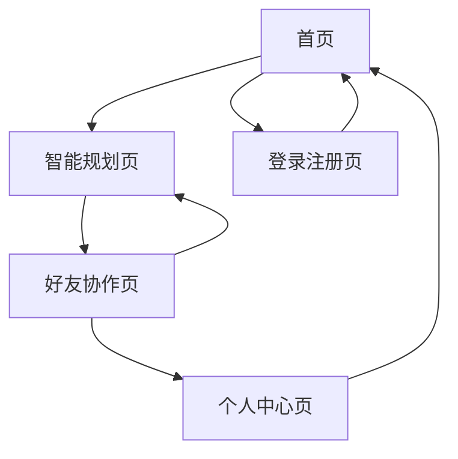

# Let'sGo（来次够）产品需求文档

## 1. 产品概述

Let'sGo（来次够）是一款专为朋友群体设计的 AI 出行计划应用，通过智能算法根据时间、位置、兴趣自动生成个性化行程计划。

产品核心价值：解决朋友聚会时写计划麻烦、临时"放鸽子"的社交痛点，让出行规划变得轻松有趣，5分钟搞定完美行程。

目标市场：年轻群体的社交出行场景，预计覆盖大学生、职场新人等注重社交体验的用户群体。

## 2. 核心功能

### 2.1 用户角色

| 角色 | 注册方式 | 核心权限 |
|------|----------|----------|
| 普通用户 | 微信/手机号快速注册 | 创建行程、加入朋友计划、查看推荐 |
| 计划发起者 | 普通用户升级 | 创建群组计划、邀请好友、管理行程状态 |

### 2.2 功能模块

我们的 Let'sGo 应用包含以下主要页面：

1. **首页**：Hero 展示区、快速创建入口、热门推荐
2. **智能规划页**：AI 行程生成、参数设置、结果展示
3. **好友协作页**：邀请好友、共同确认、实时同步
4. **个人中心页**：历史行程、偏好设置、提醒管理
5. **登录注册页**：用户认证、快速注册

### 2.3 页面详情

| 页面名称 | 模块名称 | 功能描述 |
|----------|----------|----------|
| 首页 | Hero 展示区 | 品牌 slogan "来次够，不再鸽！"、主 CTA 按钮、轻松出行氛围插画 |
| 首页 | 快速创建 | 一键开始规划、热门目的地推荐、最近使用记录 |
| 首页 | 功能介绍 | 智能生成、好友同步、不鸽提醒三大核心功能展示 |
| 智能规划页 | 参数输入 | 人数选择、位置设定、时间安排、兴趣标签选择 |
| 智能规划页 | AI 生成 | 智能算法生成行程、路线优化、活动推荐、预算估算 |
| 智能规划页 | 结果展示 | 行程时间轴、地点详情、交通方式、可编辑调整 |
| 好友协作页 | 邀请系统 | 分享链接、微信邀请、好友列表管理 |
| 好友协作页 | 协作确认 | 实时投票、意见反馈、最终确认状态 |
| 好友协作页 | 提醒通知 | 出行倒计时、天气提醒、不鸽承诺 |
| 个人中心页 | 历史记录 | 过往行程、收藏地点、好友评价 |
| 个人中心页 | 偏好设置 | 兴趣标签、预算范围、出行习惯 |
| 登录注册页 | 用户认证 | 微信登录、手机验证、快速注册流程 |

## 3. 核心流程

**主要用户操作流程：**

1. **快速规划流程**：用户进入首页 → 点击"立即生成出行计划" → 输入基本信息（人数、位置、时间、兴趣）→ AI 生成行程 → 预览调整 → 分享给好友

2. **好友协作流程**：发起者分享计划 → 好友点击链接加入 → 查看行程详情 → 投票确认或提出修改建议 → 最终确认参与 → 系统发送提醒

3. **出行提醒流程**：行程确认后 → 系统自动设置提醒 → 出行前1天/2小时发送通知 → 天气预报 → "不鸽承诺"确认

## 4. 用户界面设计

### 4.1 设计风格

- **主色调**：活力橙色 (#FF6B35) 和清新蓝色 (#4ECDC4)
- **辅助色**：温暖黄色 (#FFE66D) 和柔和粉色 (#FF8B94)
- **按钮风格**：圆角设计，带微妙阴影的3D效果
- **字体**：主标题使用活泼的无衬线字体，正文使用易读的系统字体，16px起步
- **布局风格**：卡片式设计，顶部导航，大量留白营造轻松感
- **图标风格**：可爱的线条插画风格，配合表情符号 🚀🎉🕊️✈️🗺️

### 4.2 页面设计概览

| 页面名称 | 模块名称 | UI 元素 |
|----------|----------|----------|
| 首页 | Hero 区 | 大标题"来次够"，副标题"Let'sGo，来次就够！"，橙色渐变背景，小鸽子卡通插画，圆角CTA按钮 |
| 首页 | 功能介绍 | 三栏卡片布局，每栏配图标和简短文案，浅色背景 |
| 智能规划页 | 参数输入 | 步骤式表单，进度条显示，大按钮易点击，实时预览 |
| 智能规划页 | 结果展示 | 时间轴设计，地图集成，卡片式活动展示，滑动操作 |
| 好友协作页 | 邀请界面 | 头像展示，分享按钮突出，好友状态实时更新 |
| 个人中心页 | 个人信息 | 简洁的用户卡片，历史记录列表，设置入口明显 |

### 4.3 响应式设计

产品采用移动优先设计策略，主要针对手机端优化，同时兼容平板和桌面端。重点优化触摸交互体验，支持手势操作如滑动、长按等。