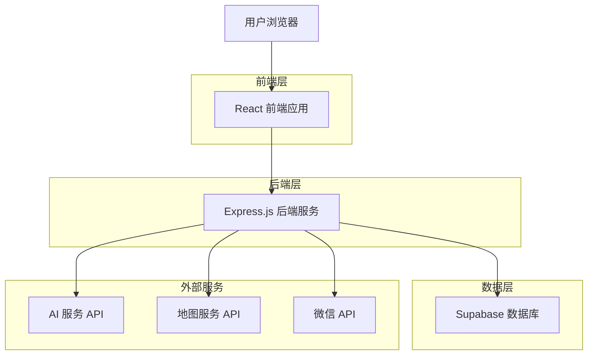
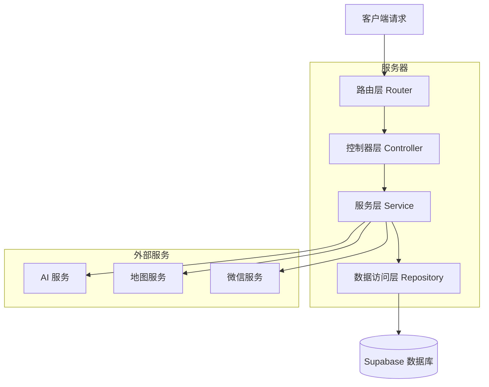
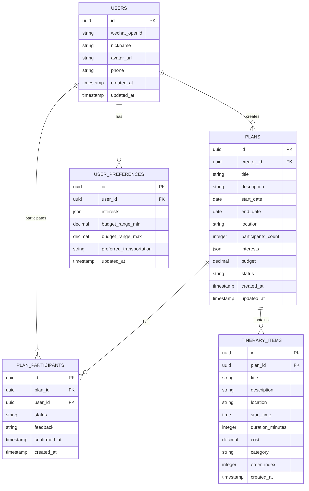

# Let'sGo（来次够）技术架构文档

## 1. 架构设计



## 2. 技术描述

- **前端**: React@18 + TypeScript + Tailwind CSS + Vite
- **后端**: Express.js@4 + TypeScript
- **数据库**: Supabase (PostgreSQL)
- **AI 服务**: OpenAI GPT API / 百度文心一言 API
- **地图服务**: 高德地图 API
- **认证**: 微信登录 + Supabase Auth

## 3. 路由定义

| 路由 | 用途 |
|------|------|
| / | 首页，展示品牌信息和快速创建入口 |
| /login | 登录页面，支持微信快速登录 |
| /plan/create | 智能规划页面，AI 生成行程计划 |
| /plan/:id | 行程详情页面，展示具体计划内容 |
| /collaborate/:id | 好友协作页面，邀请和确认功能 |
| /profile | 个人中心，历史记录和偏好设置 |
| /profile/settings | 用户设置页面 |

## 4. API 定义

### 4.1 核心 API

**用户认证相关**
```
POST /api/auth/wechat
```

请求参数:
| 参数名 | 参数类型 | 是否必需 | 描述 |
|--------|----------|----------|------|
| code | string | true | 微信授权码 |

响应参数:
| 参数名 | 参数类型 | 描述 |
|--------|----------|------|
| success | boolean | 登录是否成功 |
| token | string | JWT 认证令牌 |
| user | object | 用户基本信息 |

**智能行程生成**
```
POST /api/plan/generate
```

请求参数:
| 参数名 | 参数类型 | 是否必需 | 描述 |
|--------|----------|----------|------|
| participants | number | true | 参与人数 |
| location | string | true | 出发地点 |
| date | string | true | 出行日期 |
| duration | number | true | 行程天数 |
| interests | array | true | 兴趣标签数组 |
| budget | number | false | 预算范围 |

响应示例:
```json
{
  "success": true,
  "plan": {
    "id": "plan_123",
    "title": "周末北京一日游",
    "itinerary": [
      {
        "time": "09:00",
        "activity": "故宫参观",
        "location": "故宫博物院",
        "duration": 180,
        "cost": 60
      }
    ],
    "totalCost": 300,
    "transportation": "地铁+步行"
  }
}
```

**好友协作相关**
```
POST /api/plan/:id/invite
```

请求参数:
| 参数名 | 参数类型 | 是否必需 | 描述 |
|--------|----------|----------|------|
| friendIds | array | true | 好友ID数组 |
| message | string | false | 邀请消息 |

```
POST /api/plan/:id/confirm
```

请求参数:
| 参数名 | 参数类型 | 是否必需 | 描述 |
|--------|----------|----------|------|
| status | string | true | 确认状态: confirmed/declined/maybe |
| feedback | string | false | 反馈意见 |

## 5. 服务器架构图



## 6. 数据模型

### 6.1 数据模型定义



### 6.2 数据定义语言

**用户表 (users)**
```sql
-- 创建用户表
CREATE TABLE users (
    id UUID PRIMARY KEY DEFAULT gen_random_uuid(),
    wechat_openid VARCHAR(100) UNIQUE,
    nickname VARCHAR(50) NOT NULL,
    avatar_url TEXT,
    phone VARCHAR(20),
    created_at TIMESTAMP WITH TIME ZONE DEFAULT NOW(),
    updated_at TIMESTAMP WITH TIME ZONE DEFAULT NOW()
);

-- 创建索引
CREATE INDEX idx_users_wechat_openid ON users(wechat_openid);
CREATE INDEX idx_users_phone ON users(phone);
```

**行程计划表 (plans)**
```sql
-- 创建行程计划表
CREATE TABLE plans (
    id UUID PRIMARY KEY DEFAULT gen_random_uuid(),
    creator_id UUID NOT NULL,
    title VARCHAR(100) NOT NULL,
    description TEXT,
    start_date DATE NOT NULL,
    end_date DATE NOT NULL,
    location VARCHAR(100) NOT NULL,
    participants_count INTEGER DEFAULT 1,
    interests JSONB,
    budget DECIMAL(10,2),
    status VARCHAR(20) DEFAULT 'draft' CHECK (status IN ('draft', 'confirmed', 'completed', 'cancelled')),
    created_at TIMESTAMP WITH TIME ZONE DEFAULT NOW(),
    updated_at TIMESTAMP WITH TIME ZONE DEFAULT NOW()
);

-- 创建索引
CREATE INDEX idx_plans_creator_id ON plans(creator_id);
CREATE INDEX idx_plans_start_date ON plans(start_date);
CREATE INDEX idx_plans_status ON plans(status);
```

**行程参与者表 (plan_participants)**
```sql
-- 创建行程参与者表
CREATE TABLE plan_participants (
    id UUID PRIMARY KEY DEFAULT gen_random_uuid(),
    plan_id UUID NOT NULL,
    user_id UUID NOT NULL,
    status VARCHAR(20) DEFAULT 'invited' CHECK (status IN ('invited', 'confirmed', 'declined', 'maybe')),
    feedback TEXT,
    confirmed_at TIMESTAMP WITH TIME ZONE,
    created_at TIMESTAMP WITH TIME ZONE DEFAULT NOW(),
    UNIQUE(plan_id, user_id)
);

-- 创建索引
CREATE INDEX idx_plan_participants_plan_id ON plan_participants(plan_id);
CREATE INDEX idx_plan_participants_user_id ON plan_participants(user_id);
```

**行程项目表 (itinerary_items)**
```sql
-- 创建行程项目表
CREATE TABLE itinerary_items (
    id UUID PRIMARY KEY DEFAULT gen_random_uuid(),
    plan_id UUID NOT NULL,
    title VARCHAR(100) NOT NULL,
    description TEXT,
    location VARCHAR(100),
    start_time TIME,
    duration_minutes INTEGER,
    cost DECIMAL(8,2),
    category VARCHAR(50),
    order_index INTEGER,
    created_at TIMESTAMP WITH TIME ZONE DEFAULT NOW()
);

-- 创建索引
CREATE INDEX idx_itinerary_items_plan_id ON itinerary_items(plan_id);
CREATE INDEX idx_itinerary_items_order ON itinerary_items(plan_id, order_index);
```

**用户偏好表 (user_preferences)**
```sql
-- 创建用户偏好表
CREATE TABLE user_preferences (
    id UUID PRIMARY KEY DEFAULT gen_random_uuid(),
    user_id UUID NOT NULL UNIQUE,
    interests JSONB,
    budget_range_min DECIMAL(8,2),
    budget_range_max DECIMAL(8,2),
    preferred_transportation VARCHAR(50),
    updated_at TIMESTAMP WITH TIME ZONE DEFAULT NOW()
);

-- 创建索引
CREATE INDEX idx_user_preferences_user_id ON user_preferences(user_id);
```

**权限设置**
```sql
-- 为匿名用户授予基本读取权限
GRANT SELECT ON users TO anon;
GRANT SELECT ON plans TO anon;

-- 为认证用户授予完整权限
GRANT ALL PRIVILEGES ON users TO authenticated;
GRANT ALL PRIVILEGES ON plans TO authenticated;
GRANT ALL PRIVILEGES ON plan_participants TO authenticated;
GRANT ALL PRIVILEGES ON itinerary_items TO authenticated;
GRANT ALL PRIVILEGES ON user_preferences TO authenticated;
```

**初始化数据**
```sql
-- 插入示例兴趣标签数据
INSERT INTO user_preferences (user_id, interests, budget_range_min, budget_range_max, preferred_transportation)
VALUES 
('00000000-0000-0000-0000-000000000001', '["美食", "购物", "文化"]', 100, 500, '地铁'),
('00000000-0000-0000-0000-000000000002', '["户外", "运动", "摄影"]', 200, 800, '自驾');
```